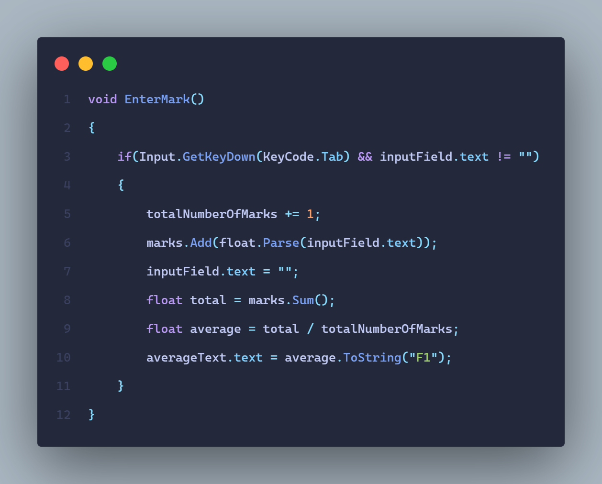
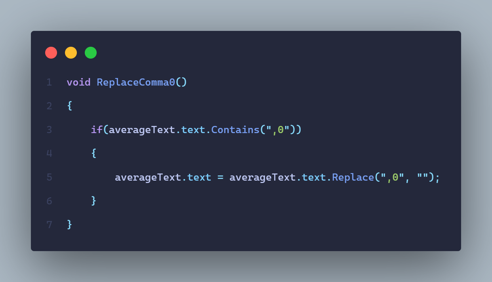

# Calculadora-de-Promedio
* Podras calcular el promedio de tus notas de una manera facil y rapida

---

# [GameManager](https://github.com/MarcoPaoletta/Calculadora-de-Promedio/blob/main/Assets/Scripts/GameManager.cs)

## Ingresar nota 

* Si se presiona la tecla Tab y el texto del campo en el cual se escriben las notas no esta vacio:
  * Sumamos 1 a la cantidad de notas totales
  * Agregamos a la lista de notas el texto del campo en el cual se escriben las notas usando `float.Parse` para convertir a `float` el texto
  * Vaciamos el campo
  * Creamos una variable `total` en la que se suman todos los valores de la lista `marks` con la funcion `Sum`
  * Sacamos el promedio dividiendo el `total` de la suma entre el `totalNumberOfMarks`
    > De esta manera si nuestras notas son 10, 8, 6, que fueron sumadas previamente en la variable `total`, se va a dividir por el `totalNumberOfMarks`, en este caso 3 dando como resultado 8
  *  Actualizamos el texto  del promedio teniendo en cuento el `average` y utilizamos `ToString("F1")` para convertirlo a `string` y que solo tome en cuenta 1 `float`

---

## Reemplazar el ,0
* Como ya sabemos, cuando estamos sacando el promedio solo dejamos un valor `float`. Esto a su vez provoca que si el numero es un `int` aparezca con un ",0" al final

* Si el texto del promedio contiene ",0":
  * Vamos a reemplazar ese ",0" directamente a "", es decir, a nada, eliminandolo entonces por completo

---

# Descargar Unity, ejecutar el proyecto y utilizar Visual Studio

## Descargar Unity
* Dirigirnos al [sitio oficial de descarga](https://unity.com/download) de Unity y descargar el hub como cualquier otra aplicacion simplemente tocando siguiente, siguiente, siguiente
* Una vez instalado, nos dirigimos  a la parte de `Installs`, luego en `ADD` e instalamos la version de Unity utilizada en este proyecto que es la `2020.3.28f1`
* Lo siguiente es seleccionar los modulos. El unico que vamos a seleccionar es el que dice `Microsoft Visual Studio Community` seguido de un año que puede ir cambiando
* Esperamos a que se instale y ya estaria

---

## Ejecutar el proyecto
* Nos dirigimos a la parte de `Installs`, luego en `OPEN` y abrimos la carpeta del proyecto la cual deberia de tener una carpeta con el nombre del proyecto, por ejemplo `John And Grunt` y otra con el nombre `My project`
* Con esto, ya tendremos el proyecto importado

---

## Utilizar Visual Studio
* Con todos los pasos anteriores ya se puede ejecutar y probar el proyecto, no obstante, no podemos realizar cambio en ningun script ya que Unity no tiene ningun IDE o editor de texto incluido
* Entonces, descargamos [Visual Studio](https://visualstudio.microsoft.com/es/downloads/) como cualquier otra aplicacion simplemente tocando siguiente, siguiente, siguiente
* Lo siguiente es seleccionar los modulos. Los modulos que vamos a seleccionar son: `.NET desktop development`  y `Game development with Unity`
* Vamos a algun proyecto de Unity, tocamos en `Edit` -> `Preferences` -> `External Tools` -> `External Script Editor` y seleccionamos `Microsoft Visual Studio Community` seguido de un año que puede ir cambiando
* Ahora, podremos modificar los scripts de Unity que son escritos en C#